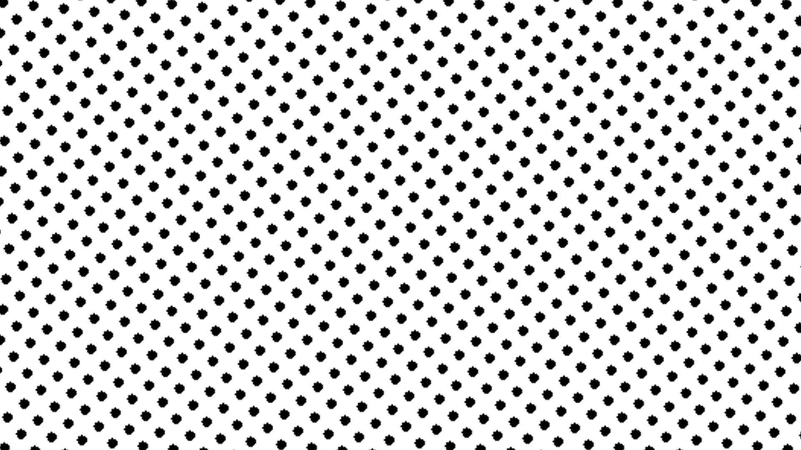
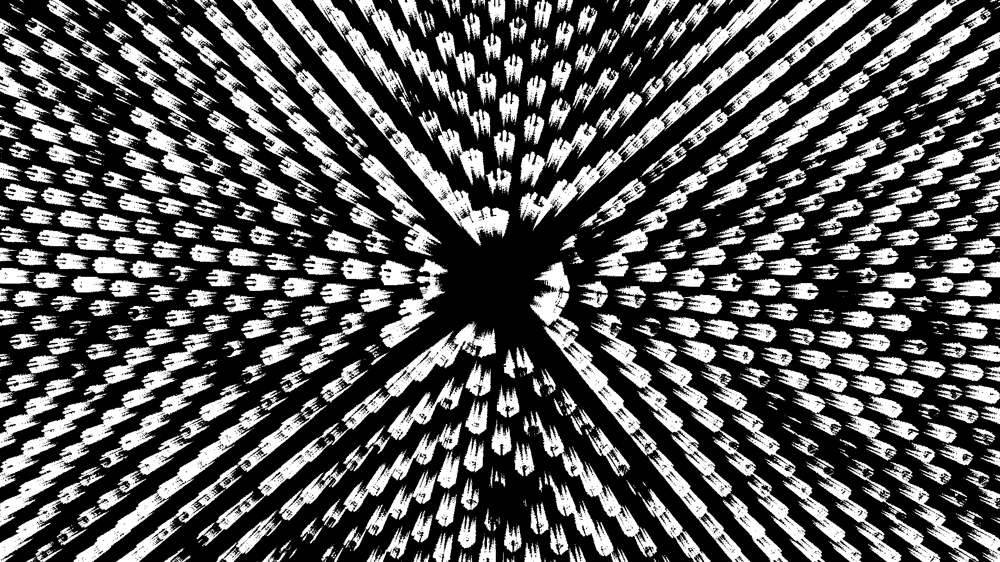
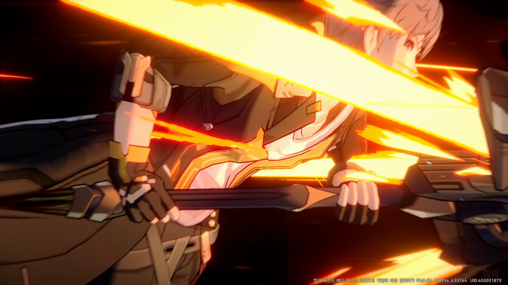
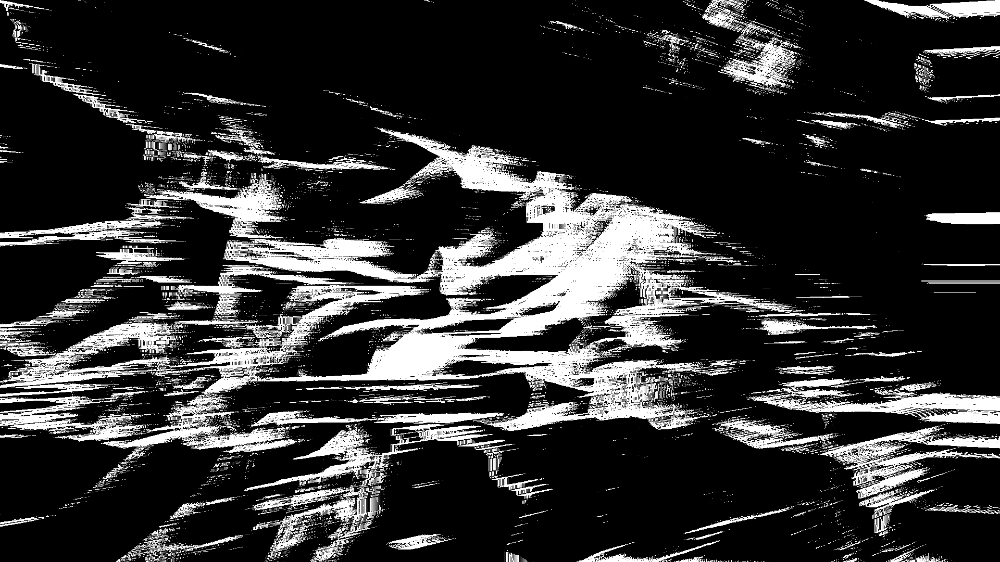
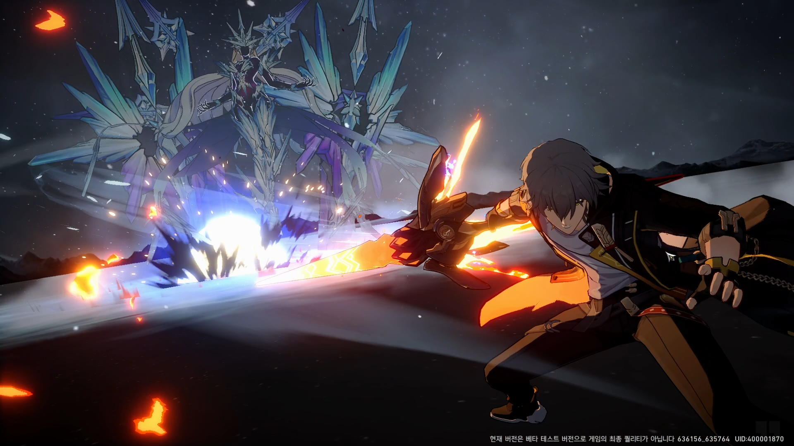
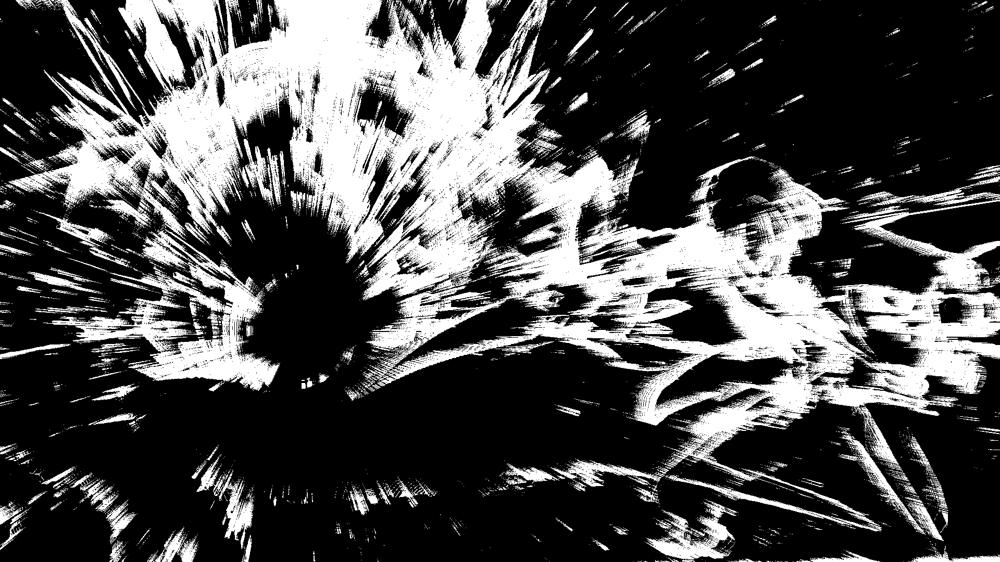

Convert process image to gray scale image with concentrate line forward to specific point.   
1. make edge image with laplacian   
2. generate random noise image   
3. multiply edge image with noise image
4. calculate radial blur   
   
Example image bring from game of honkai: star rail.   
   
test1, dot image   
original image  |  blur image
:----------:|:----------:
  |  
   
test2, right blur   
original image  |  blur image
:----------:|:----------:
  |  
   
test3, specific point blur   
original image  |  blur image
:----------:|:----------:
  |  

```bash
python make_effect.py --csv [variable saved csv file]
```